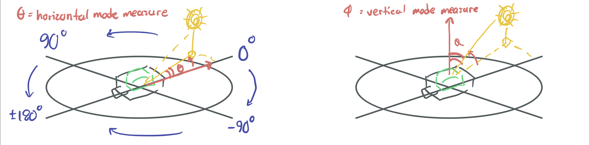

+++
title = "Stationeers"

[taxonomies]
tags = ["games", "notes", "tutorial"]

[extra]
math = true
+++

Stationeers (on [steam](https://store.steampowered.com/app/544550/Stationeers/)) is a pretty complex
space engineering game; much more so than a lot of what else is out there. Constructing a single
structure involves several steps. For example, constructing an autolathe involves welding on iron
sheets, fixing cables, welding on plastic sheets, and then using a wrench. Here I've compiled some
of my own resources, notes and tutorials.

<!-- more -->

# Resources

- [Stationeering](stationeering.com/) is a database of the entities in Stationeers, but most
  impressive is its MIPS simulator.
- [Stationeers MIPS Sublime Syntax](mips.sublime-syntax), a bare
  basic Sublime syntax file to support highlighting MIPS code on Zola sites (like this one).

# Notes

## Atmospherics

- Canisters start to take damage at around 10,145 kPa

# Tutorials

## Solar energy

The first major hurdle of the game is establishing a hands-off power source, and solar is the only
immediately available solution. However, a solar panel on its own requires manual orientation its
yaw and pitch. Automatic tracking of the sun can be accomplished with the use of light sensors
and logic units, but it's an involved project that can be daunting for newcomers. Below is a
tutorial on such an automation project.

Required materials if using only logic chips:

- 2 x Kit (Sensors)
- 4 x Kit (Logic IO)
- 2 x Kit (Logic Processor)
- 2 x Kit (Logic Memory)
- 1 x Kit (Logic Switch)

Or if using a MIPS programmable IC10 chip:

- 2 x Kit (Sensors)
- 2 x Kit (Logic IO)
- 2 x Kit (Logic Memory)
- 1 x Kit (IC Housing)
- 1 x Integrated Circuit (IC10)
- A computer with an IC editor motherboard to program the IC

### Set up the panels and sensors

The orientation of solar panels that is in general the most effective is simply placing them on the
ground. It's also the most intuitive, since the yaw and pitch of the panels is the same as the
player's. Two sensors are required to track the sun on any planet, one in horizontal mode to set the
panel yaw, and another in vertical mode to set the panel pitch. Light sensors can be configured to
one of three modes, but the *horizontal* and *vertical* modes are the most useful:

- **Horizontal:** Reports the angle between the vector pointing away from the data port (the
  reference vector, orthogonal to the sensor surface normal) and the vector towards the sun
  projected onto the sensor surface. Sun angles counter-clockwise of the reference vector are measured
  positively.

- **Vertical:** Reports the angle between the vector towards the sun projected onto the sensor
  surface and the vector towards the sun.

Setting the mode of a light sensor requires a logic writer to write to the sensor's `Mode` parameter,
using either a memory chip or a dial as input, where the values 0, 1 and 2 correspond to the modes
*Default*, *Horizontal* and *Vertical* respectively. (Alternatively, a MIPS program can set the
modes.)



### Fixing the yaw

Solar panels start at 90 degrees yaw, pointing towards the data port, and 50% pitch (pointing
directly upwards). Dropping the pitch towards 0% points the solar panel towards the data port, while
increasing the pitch towards 100% points the solar panel away. It's convenient to have the solar
panels and yaw light sensors oriented such that angle measured from the sensor is immediately
compatible with the panel yaw, without translation. Unintuitively though, the measurements from a
horizontal mode light sensor placed on the ground decrease clockwise while panel yaws increase
clockwise (for example, if such a sensor reads 90 at dawn, it will read 0 at noon and -90 at dusk;
thus to get the correct panel yaw we need to subtract the measurement from 90 to get 0, 90 and 180).
So instead of placing the horizontal sensor on the ground we can place it on a ceiling such that the
measurements increase clockwise, and it measures 0 at dawn, 90 at noon and 180 at dusk. Now
translation into panel yaw is needed.

### Fixing the pitch

The location of pitch sensor is a no brainer, with the surface orientation not mattering for the
measured angle. All that matters is that the sensor be placed on the ground so that the measurement
reads 90 at dawn, 0 at noon and 90 at dusk. However, what isn't a no brainer is that solar panel
pitch has only a 150 degree range and is set as a percentage (0% for 15 degrees from the horizon and
50% for completely vertical). Then to get maximum effectiveness we first translate the pitch sensor
measure by subtracting it from 75, bringing the range to -15 at dawn, 75 at noon and -15 at dusk
(and 0 when the sun is at 15 degrees, the minimum yaw of the panels). Secondly divide the translated
measure by 1.5 (equivalently $\frac{100}{150}$) and we get the percentages we want: 0% when the sun
is at 15 degrees and 50% at 90.

### Tracking with only logic chips

With the light sensors in place (horizontal yaw on a ceiling, vertical pitch on a floor) we can
implement the automation. First, two logic readers, `hReader` and `vReader`, read the solar angles
from the sensors. If the sensors and panels were oriented ideally as previously described, the solar
panel `Horizontal` parameter can be set directly by a batch writer `hWriter` using the `hReader`
value. As the vertical angle needs some transformation, we first use a math unit `vShift` to
translate the measurement by subtracting the vertical reader value from a memory chip `vMemShift`
with setting 75; then another math unit `vScale` divides the translation by a memory chip
`vMemScale` with setting 1.5 to give the pitch percentage; lastly the pitch percentage from `vScale`
is written to the solar panel `Vertical` parameter by a second batch writer `vWriter`.

Name | Type | Settings
--- | :-- | :--
`hReader` | Logic Reader | `In: hSensor, Var: SolarAngle`
`vReader` | Logic Reader | `In: vSensor, Var: SolarAngle`
`vMemShift` | Memory | `Setting: 75`
`vMemScale` | Memory | `Setting: 1.5`
`vShift` | Math Unit | `1: vMemShift, 2: vReader, Out: Subtract`
`vScale` | Math Unit | `1: vShift, 2: vMemScale, Out: Divide`
`hWriter` | Batch Writer | `In: hReader, OutType: Solar Panel, OutVar: Horizontal`
`vWriter` | Batch Writer | `In: vScale, OutType: Solar Panel, OutVar: Vertical`

### Tracking with a MIPS program

In total, the non-MIPS solution uses 6 powered chips. Using a MIPS programmed IC10 chip reduces
this to two memory chips and two batch writers, which both is more energy efficient and easy to
setup. You can also use a single sensor this way, as the IC10 chip can change the `Mode` parameter
on its own.

The setup of the sensors and the panels is the same as the non-MIPS solution, except we only use the
sensor that's on the ground, and the batch writers
now pull input from their corresponding memory chips. The `Setting` parameters for the memory chips
(the horizontal angle and vertical percentage) are written by the MIPS program.

#### Logic chips

Name | Type | Settings
--- | :-- | :--
`hMem` | Memory |
`vMem` | Memory |
`hWriter` | Batch Writer | `In: hMem, OutType: Solar Panel, OutVar: Horizontal`
`vWriter` | Batch Writer | `In: vMem, OutType: Solar Panel, OutVar: Vertical`
`ic` | IC Housing | `00: hSensor, 01: hMem, 03: vSensor, 04: vMem`

#### MIPS program

``` mips
alias sensor d0
alias angle r0
alias hMem d1
alias vMem d2

start:
jal horizontal # set horizontal parameter for solar panels
jal vertical # set vertical parameter for solar panels
j start

horizontal:
s sensor Mode 1 # change sensor to horizontal mode
yield # and wait for this to take effect
# load the horizontal solar and from
# the sensor into the angle register
l angle sensor SolarAngle
sub angle 0 angle
s hMem Setting angle # write to horizontal memory
j ra

vertical:
s sensor Mode 2 # change sensor to vertical mode
yield # and wait for this to take effect
# load the vertical solar angle from
# the sensor into the angle register
l angle sensor SolarAngle
sub angle 75 angle # transform the angle to a percentage
div angle angle 1.5
s vMem Setting angle # write to vertical memory
j ra
```

